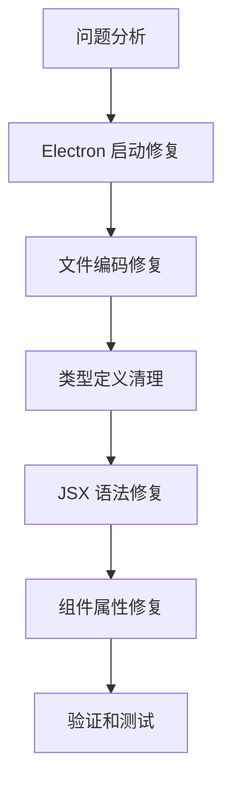

# Design Document

## Overview

本设计文档旨在解决 Multi-Agent IDE 项目中的多种启动和编译错误。我们将采用分层修复策略，优先解决阻塞性问题，然后逐步修复编译错误和类型问题。

## Architecture

### 修复策略分层



### 核心问题分类

1. **阻塞性问题**：Electron 启动失败
2. **编译问题**：TypeScript 编译错误
3. **语法问题**：JSX 语法错误
4. **类型问题**：类型定义冲突和不匹配

## Components and Interfaces

### 1. Electron 启动修复组件

#### WindowManager 重构
- **问题**：构造函数中调用 `screen.getAllDisplays()` 导致启动失败
- **解决方案**：延迟初始化模式

```typescript
interface WindowManagerConfig {
  isDevelopment: boolean;
  stateFilePath: string;
  snapThreshold: number;
}

interface WindowManagerState {
  isInitialized: boolean;
  snapZones: WindowSnapZone[];
  displayHandlersSetup: boolean;
}
```

#### 初始化流程重构
```typescript
interface InitializationStep {
  name: string;
  dependencies: string[];
  execute: () => Promise<void>;
  rollback?: () => Promise<void>;
}
```

### 2. 文件编码修复组件

#### 编码检测和修复
```typescript
interface FileEncodingFixer {
  detectEncoding(filePath: string): Promise<string>;
  convertToUTF8(filePath: string): Promise<void>;
  validateEncoding(filePath: string): Promise<boolean>;
}
```

### 3. 类型定义清理组件

#### 类型冲突解决器
```typescript
interface TypeConflictResolver {
  scanForDuplicates(): Promise<TypeConflict[]>;
  resolveConflict(conflict: TypeConflict): Promise<void>;
  validateTypeConsistency(): Promise<ValidationResult>;
}

interface TypeConflict {
  identifier: string;
  locations: string[];
  conflictType: 'duplicate' | 'incompatible';
}
```

### 4. JSX 修复组件

#### JSX 语法验证器
```typescript
interface JSXValidator {
  validateFile(filePath: string): Promise<JSXValidationResult>;
  fixCommonIssues(filePath: string): Promise<void>;
  generateReport(): ValidationReport;
}

interface JSXValidationResult {
  isValid: boolean;
  errors: JSXError[];
  warnings: JSXWarning[];
}
```

## Data Models

### 错误分类模型
```typescript
enum ErrorCategory {
  ELECTRON_STARTUP = 'electron_startup',
  TYPESCRIPT_COMPILATION = 'typescript_compilation',
  JSX_SYNTAX = 'jsx_syntax',
  TYPE_DEFINITION = 'type_definition',
  FILE_ENCODING = 'file_encoding'
}

interface ProjectError {
  id: string;
  category: ErrorCategory;
  severity: 'critical' | 'high' | 'medium' | 'low';
  file: string;
  line?: number;
  column?: number;
  message: string;
  suggestedFix?: string;
}
```

### 修复进度模型
```typescript
interface FixProgress {
  totalErrors: number;
  fixedErrors: number;
  remainingErrors: number;
  currentStep: string;
  estimatedTimeRemaining: number;
}
```

## Error Handling

### 分级错误处理策略

1. **Critical 错误**：立即停止并修复
   - Electron 启动失败
   - 严重的类型定义冲突

2. **High 错误**：优先修复
   - JSX 语法错误
   - 缺失的必需属性

3. **Medium 错误**：批量修复
   - 类型不匹配警告
   - 未使用的导入

4. **Low 错误**：最后处理
   - 代码风格问题
   - 可选属性警告

### 错误恢复机制
```typescript
interface ErrorRecoveryStrategy {
  canRecover(error: ProjectError): boolean;
  recover(error: ProjectError): Promise<RecoveryResult>;
  rollback(error: ProjectError): Promise<void>;
}
```

## Testing Strategy

### 修复验证流程

1. **单元测试**：每个修复组件的独立测试
2. **集成测试**：修复后的启动流程测试
3. **回归测试**：确保修复不破坏现有功能
4. **端到端测试**：完整的开发环境启动测试

### 测试用例设计

#### Electron 启动测试
```typescript
describe('Electron Startup', () => {
  test('should start without screen module errors', async () => {
    // 测试 WindowManager 延迟初始化
  });
  
  test('should initialize snap zones after app ready', async () => {
    // 测试 snap zones 正确初始化时机
  });
});
```

#### 编译测试
```typescript
describe('TypeScript Compilation', () => {
  test('should compile without errors', async () => {
    // 测试所有 TypeScript 文件编译成功
  });
  
  test('should have consistent type definitions', async () => {
    // 测试类型定义一致性
  });
});
```

### 自动化验证

#### 持续集成检查
```typescript
interface CIValidation {
  checkElectronStartup(): Promise<boolean>;
  validateTypeScript(): Promise<CompilationResult>;
  verifyJSXSyntax(): Promise<ValidationResult>;
  testFileEncoding(): Promise<EncodingResult>;
}
```

## Implementation Phases

### Phase 1: 紧急修复 (Critical Issues)
1. 修复 WindowManager 的 screen 模块使用问题
2. 解决文件编码导致的二进制文件识别问题
3. 清理重复的类型定义

### Phase 2: 编译修复 (High Priority)
1. 修复所有 JSX 语法错误
2. 修复组件属性类型不匹配问题
3. 解决缺失属性错误

### Phase 3: 类型优化 (Medium Priority)
1. 统一类型定义导入
2. 修复函数参数类型不匹配
3. 优化类型推断

### Phase 4: 验证和优化 (Low Priority)
1. 全面测试修复结果
2. 性能优化
3. 代码质量提升

## Risk Mitigation

### 潜在风险和缓解策略

1. **修复引入新问题**
   - 缓解：每次修复后立即测试
   - 备份：Git 分支管理和回滚策略

2. **大量文件修改**
   - 缓解：分批次修复，逐步验证
   - 监控：自动化测试覆盖

3. **类型定义破坏性变更**
   - 缓解：向后兼容的类型定义
   - 验证：全面的类型检查

### 回滚计划
```typescript
interface RollbackPlan {
  checkpoints: string[];
  rollbackSteps: RollbackStep[];
  validationTests: string[];
}

interface RollbackStep {
  description: string;
  execute: () => Promise<void>;
  verify: () => Promise<boolean>;
}
```

## Performance Considerations

### 编译性能优化
1. **增量编译**：只重新编译修改的文件
2. **并行处理**：同时修复多个独立文件
3. **缓存策略**：缓存类型检查结果

### 启动性能优化
1. **延迟加载**：非关键组件延迟初始化
2. **异步初始化**：并行执行独立的初始化步骤
3. **资源预加载**：提前加载必需资源

## Monitoring and Logging

### 修复过程监控
```typescript
interface FixMonitor {
  logProgress(step: string, progress: number): void;
  reportError(error: ProjectError): void;
  trackPerformance(operation: string, duration: number): void;
  generateSummary(): FixSummary;
}
```

### 日志策略
1. **详细日志**：记录每个修复步骤
2. **错误追踪**：完整的错误堆栈信息
3. **性能指标**：修复时间和资源使用情况