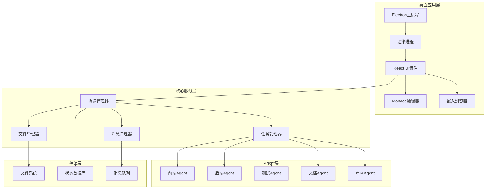
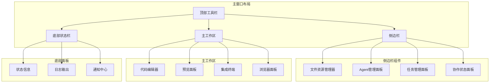

# Multi-Agent IDE Design Document

## Overview

多 agent 协作 IDE 是一个基于微服务架构的智能开发环境，支持多个专门化 AI agent 同时协作开发。系统采用事件驱动架构，通过中央协调器管理 agent 间的协作，确保高效、无冲突的开发流程。

## Architecture

### 系统架构图



### 核心组件

1. **协调管理器 (Coordination Manager)**

   - 系统的中央控制器
   - 负责 agent 生命周期管理
   - 协调 agent 间的协作流程

2. **任务管理器 (Task Manager)**

   - 任务分解和分配
   - 优先级管理和调度
   - 依赖关系处理

3. **文件管理器 (File Manager)**

   - 文件锁定机制
   - 版本控制集成
   - 冲突检测和解决

4. **消息管理器 (Message Manager)**
   - Agent 间通信
   - 事件发布订阅
   - 实时状态同步

## Desktop Application Design

### Electron 架构设计

系统采用 Electron 框架构建跨平台桌面应用，包含以下核心组件：

#### 主进程 (Main Process)

- 应用生命周期管理
- 窗口创建和管理
- 系统集成（菜单、托盘、通知）
- 文件系统访问
- 进程间通信协调

#### 渲染进程 (Renderer Process)

- React 应用运行环境
- UI 组件渲染
- 用户交互处理
- 与主进程通信

### UI 组件架构



### 核心 UI 组件设计

#### 1. Agent 管理界面

- **Agent 创建向导**: 分步骤配置新 Agent
- **Agent 列表视图**: 显示所有 Agent 状态和信息
- **Agent 详情面板**: 实时监控单个 Agent 的工作状态
- **Agent 控制面板**: 启动、暂停、重启 Agent 操作

#### 2. 代码编辑器集成

- **Monaco Editor**: VS Code 同款编辑器核心
- **多标签页支持**: 同时编辑多个文件
- **分屏编辑**: 并排比较和编辑文件
- **语法高亮**: 支持多种编程语言
- **智能提示**: 代码补全和错误检查
- **文件锁定指示**: 显示文件被哪个 Agent 锁定

#### 3. 任务管理界面

- **看板视图**: Kanban 风格的任务管理
- **甘特图**: 任务时间线和依赖关系可视化
- **任务详情**: 任务描述、要求、进度跟踪
- **分配界面**: 手动或自动分配任务给 Agent

#### 4. 文件管理器

- **项目文件树**: 层级显示项目结构
- **文件预览**: 快速预览文件内容
- **搜索功能**: 全局文件和内容搜索
- **版本控制**: Git 集成和可视化
- **冲突解决**: 文件冲突的可视化解决界面

#### 5. 协作监控面板

- **实时活动流**: Agent 活动时间线
- **协作会话**: 当前进行的协作会话
- **消息中心**: Agent 间通信记录
- **性能监控**: 系统资源使用情况

#### 6. 浏览器集成

- **嵌入式浏览器**: Chromium 内核
- **开发者工具**: 完整的调试功能
- **多标签页**: 支持多个页面同时预览
- **热重载**: 代码变更自动刷新预览

### 用户体验设计

#### 主题和样式

- **深色/浅色主题**: 支持主题切换
- **自定义配色**: 用户可自定义界面颜色
- **响应式布局**: 适配不同屏幕尺寸
- **可调整面板**: 用户可调整各面板大小

#### 交互设计

- **拖拽支持**: 文件拖拽、面板重排
- **快捷键**: 完整的键盘快捷键支持
- **上下文菜单**: 右键菜单提供快速操作
- **工具提示**: 悬停显示详细信息

#### 通知系统

- **系统通知**: 重要事件的桌面通知
- **状态指示**: 实时状态变化提示
- **进度显示**: 长时间操作的进度条
- **错误提示**: 友好的错误信息展示

## Components and Interfaces

### Agent 接口定义

```typescript
interface IAgent {
  id: string;
  name: string;
  specialization: AgentType;
  status: AgentStatus;

  // 核心方法
  initialize(config: AgentConfig): Promise<void>;
  executeTask(task: Task): Promise<TaskResult>;
  handleMessage(message: AgentMessage): Promise<void>;
  shutdown(): Promise<void>;

  // 协作方法
  requestFileAccess(filePath: string): Promise<FileAccessToken>;
  releaseFileAccess(token: FileAccessToken): Promise<void>;
  sendMessage(targetAgent: string, message: AgentMessage): Promise<void>;
  subscribeToEvents(eventTypes: EventType[]): void;
}
```

### 任务系统接口

```typescript
interface ITaskManager {
  decomposeTask(requirement: string): Promise<Task[]>;
  assignTask(task: Task, agentId?: string): Promise<void>;
  getTaskQueue(agentId: string): Promise<Task[]>;
  updateTaskStatus(taskId: string, status: TaskStatus): Promise<void>;
  getDependencies(taskId: string): Promise<Task[]>;
}
```

### 文件管理接口

```typescript
interface IFileManager {
  requestLock(filePath: string, agentId: string): Promise<FileLock>;
  releaseLock(lockId: string): Promise<void>;
  detectConflicts(filePath: string): Promise<Conflict[]>;
  resolveConflict(
    conflictId: string,
    resolution: ConflictResolution
  ): Promise<void>;
  getFileHistory(filePath: string): Promise<FileChange[]>;
}
```

### 桌面应用技术接口

#### Electron 主进程接口

```typescript
interface IElectronMain {
  // 窗口管理
  createWindow(options: WindowOptions): Promise<BrowserWindow>;
  closeWindow(windowId: string): Promise<void>;

  // 文件系统操作
  readFile(filePath: string): Promise<string>;
  writeFile(filePath: string, content: string): Promise<void>;
  watchDirectory(dirPath: string): Promise<FileWatcher>;

  // 系统集成
  showNotification(title: string, body: string): Promise<void>;
  setTrayMenu(menu: MenuTemplate): Promise<void>;
  registerGlobalShortcut(
    accelerator: string,
    callback: () => void
  ): Promise<void>;
}
```

#### UI 状态管理接口

```typescript
interface IUIStateManager {
  // 布局状态
  saveLayout(layout: LayoutConfig): Promise<void>;
  loadLayout(): Promise<LayoutConfig>;

  // 主题管理
  setTheme(theme: "light" | "dark" | "custom"): Promise<void>;
  getTheme(): Promise<string>;

  // 用户偏好
  updatePreferences(prefs: UserPreferences): Promise<void>;
  getPreferences(): Promise<UserPreferences>;
}
```

#### 编辑器集成接口

```typescript
interface IEditorManager {
  // 编辑器操作
  openFile(filePath: string): Promise<void>;
  closeFile(filePath: string): Promise<void>;
  saveFile(filePath: string): Promise<void>;

  // 编辑器状态
  getOpenFiles(): Promise<string[]>;
  getCurrentFile(): Promise<string | null>;

  // 编辑器功能
  formatCode(filePath: string): Promise<void>;
  showDefinition(filePath: string, position: Position): Promise<void>;
  findReferences(filePath: string, position: Position): Promise<Reference[]>;
}
```

## Data Models

### Agent 模型

```typescript
enum AgentType {
  FRONTEND = "frontend",
  BACKEND = "backend",
  TESTING = "testing",
  DOCUMENTATION = "documentation",
  CODE_REVIEW = "code_review",
  DEVOPS = "devops",
}

enum AgentStatus {
  IDLE = "idle",
  WORKING = "working",
  WAITING = "waiting",
  ERROR = "error",
  OFFLINE = "offline",
}

interface Agent {
  id: string;
  name: string;
  type: AgentType;
  status: AgentStatus;
  config: AgentConfig;
  capabilities: string[];
  currentTask?: string;
  workload: number;
  createdAt: Date;
  lastActive: Date;
}
```

### 任务模型

```typescript
enum TaskStatus {
  PENDING = "pending",
  IN_PROGRESS = "in_progress",
  COMPLETED = "completed",
  FAILED = "failed",
  BLOCKED = "blocked",
}

enum TaskPriority {
  LOW = 1,
  MEDIUM = 2,
  HIGH = 3,
  CRITICAL = 4,
}

interface Task {
  id: string;
  title: string;
  description: string;
  type: string;
  status: TaskStatus;
  priority: TaskPriority;
  assignedAgent?: string;
  dependencies: string[];
  estimatedTime: number;
  files: string[];
  requirements: string[];
  createdAt: Date;
  startedAt?: Date;
  completedAt?: Date;
}
```

### 协作模型

```typescript
interface CollaborationSession {
  id: string;
  participants: string[];
  sharedFiles: string[];
  communicationChannel: string;
  startTime: Date;
  endTime?: Date;
  status: "active" | "paused" | "completed";
}

interface AgentMessage {
  id: string;
  from: string;
  to: string | string[];
  type: "info" | "request" | "response" | "alert";
  content: any;
  timestamp: Date;
  requiresResponse: boolean;
}
```

## Error Handling

### 错误分类和处理策略

1. **Agent 错误**

   - Agent 崩溃：自动重启机制
   - 任务执行失败：重试策略和降级处理
   - 通信超时：重新建立连接

2. **协作冲突**

   - 文件锁定冲突：队列机制和优先级处理
   - 任务依赖冲突：依赖图重新计算
   - 资源竞争：负载均衡和资源分配

3. **系统错误**
   - 服务不可用：熔断器模式
   - 数据不一致：事务回滚和状态恢复
   - 网络分区：分布式一致性处理

### 错误恢复机制

```typescript
interface ErrorRecoveryStrategy {
  detectError(error: Error): ErrorType;
  canRecover(errorType: ErrorType): boolean;
  recover(context: ErrorContext): Promise<RecoveryResult>;
  escalate(error: Error): Promise<void>;
}
```

## Testing Strategy

### 测试层次

1. **单元测试**

   - Agent 核心功能测试
   - 任务管理逻辑测试
   - 文件操作测试

2. **集成测试**

   - Agent 间通信测试
   - 协调器功能测试
   - 数据一致性测试

3. **端到端测试**
   - 完整协作流程测试
   - 并发场景测试
   - 故障恢复测试

### 测试工具和框架

- **Mock Agent 系统**：模拟不同类型的 agent 行为
- **并发测试框架**：测试多 agent 并发场景
- **性能测试工具**：监控系统性能和资源使用
- **混沌工程**：测试系统在故障条件下的表现

### 关键测试场景

1. **多 Agent 并发文件修改**
2. **任务依赖链执行**
3. **Agent 故障和恢复**
4. **大规模项目协作**
5. **实时通信延迟测试**

## 技术栈和实现

### 后端服务技术栈

#### 核心运行时和框架
- **Node.js 18+**: 服务端JavaScript运行时
- **Express.js**: Web应用框架
- **TypeScript**: 类型安全的JavaScript开发
- **ts-node**: TypeScript直接执行

#### Agent系统
- **LangChain**: AI Agent框架和工具链
- **OpenAI API**: 大语言模型服务
- **Docker**: Agent容器化和隔离运行
- **Bull Queue**: 任务队列管理

#### 数据存储和缓存
- **SQLite**: 轻量级关系数据库
- **Redis**: 内存缓存和消息队列
- **LevelDB**: 键值存储（可选）

#### 实时通信
- **Socket.io**: WebSocket实时通信
- **EventEmitter3**: 事件驱动架构
- **RxJS**: 响应式编程

#### 文件系统和版本控制
- **fs-extra**: 增强的文件系统操作
- **chokidar**: 文件监听
- **simple-git**: Git操作集成
- **diff**: 文件差异比较

### 桌面应用技术栈

#### 核心框架

- **Electron**: 跨平台桌面应用框架
- **React 18**: 用户界面框架
- **TypeScript**: 类型安全的 JavaScript
- **Webpack/Vite**: 构建工具

#### UI 组件和样式

- **Ant Design**: 企业级 UI 组件库
- **Styled-components**: CSS-in-JS 样式方案
- **React DnD**: 拖拽功能实现
- **Recharts**: 数据可视化图表

#### 代码编辑器

- **Monaco Editor**: VS Code 编辑器核心
- **Language Server Protocol**: 语言服务支持
- **Tree-sitter**: 语法解析和高亮
- **Prettier + ESLint**: 代码格式化

#### 状态管理

- **Redux Toolkit**: 状态管理
- **RxJS**: 响应式编程
- **Immer**: 不可变状态更新

#### 文件系统和工具

- **chokidar**: 文件监听
- **isomorphic-git**: Git 集成
- **node-pty**: 终端集成
- **fuse.js**: 模糊搜索

### 测试技术栈

#### 测试框架
- **Jest**: 单元测试和集成测试
- **Playwright**: 端到端测试
- **React Testing Library**: React组件测试
- **Supertest**: API测试

#### 测试工具
- **ts-jest**: TypeScript测试支持
- **@testing-library/jest-dom**: DOM测试工具
- **msw**: Mock Service Worker
- **Spectron**: Electron应用测试（已弃用，使用Playwright替代）

### 开发工具技术栈

#### 代码质量
- **ESLint**: 代码检查
- **Prettier**: 代码格式化
- **Husky**: Git钩子管理
- **lint-staged**: 暂存文件检查

#### 构建和部署
- **Electron Builder**: 应用打包和分发
- **GitHub Actions**: CI/CD流水线
- **Webpack**: 模块打包
- **Babel**: JavaScript编译

#### 开发辅助
- **Nodemon**: 开发时自动重启
- **Concurrently**: 并行运行多个命令
- **Cross-env**: 跨平台环境变量
- **Dotenv**: 环境变量管理

### 监控和日志技术栈

#### 日志系统
- **Winston**: 结构化日志记录
- **Pino**: 高性能日志库（可选）
- **Electron-log**: Electron应用日志

#### 性能监控
- **Clinic.js**: Node.js性能分析
- **Webpack Bundle Analyzer**: 打包分析
- **React DevTools**: React性能分析

#### 错误追踪
- **Sentry**: 错误监控和追踪（可选）
- **Bugsnag**: 应用错误报告（可选）

### 进程间通信设计

#### IPC 通信模式

```typescript
// 主进程到渲染进程
interface MainToRenderer {
  "file-changed": (filePath: string, changeType: string) => void;
  "agent-status-updated": (agentId: string, status: AgentStatus) => void;
  "task-completed": (taskId: string, result: TaskResult) => void;
  notification: (title: string, message: string) => void;
}

// 渲染进程到主进程
interface RendererToMain {
  "open-file": (filePath: string) => Promise<string>;
  "save-file": (filePath: string, content: string) => Promise<void>;
  "create-agent": (config: AgentConfig) => Promise<Agent>;
  "execute-task": (taskId: string) => Promise<void>;
}
```

#### 实时数据同步

```typescript
interface IRealtimeSync {
  // Agent状态同步
  syncAgentStatus(agentId: string, status: AgentStatus): void;

  // 任务进度同步
  syncTaskProgress(taskId: string, progress: number): void;

  // 文件状态同步
  syncFileStatus(filePath: string, lockStatus: FileLockStatus): void;

  // 协作会话同步
  syncCollaborationSession(
    sessionId: string,
    session: CollaborationSession
  ): void;
}
```

## 性能考虑

### 桌面应用性能优化

#### 渲染性能

- **虚拟滚动**: 大列表的性能优化
- **代码分割**: 按需加载组件
- **React.memo**: 组件渲染优化
- **Web Workers**: 计算密集任务后台处理

#### 内存管理

- **组件卸载清理**: 防止内存泄漏
- **大文件流式处理**: 避免内存溢出
- **缓存策略**: LRU 缓存机制
- **垃圾回收优化**: 及时释放不用的对象

#### 文件系统优化

- **增量文件监听**: 只监听必要的文件变化
- **批量文件操作**: 减少系统调用次数
- **文件缓存**: 常用文件内容缓存
- **异步 IO**: 非阻塞文件操作

### 扩展性设计

- **水平扩展**：支持动态添加 agent 实例
- **负载均衡**：智能任务分配算法
- **缓存策略**：减少重复计算和 IO 操作
- **异步处理**：非阻塞的消息和任务处理

### 监控指标

#### 应用性能指标

- UI 响应时间
- 内存使用量
- CPU 使用率
- 文件 IO 性能

#### 业务指标

- Agent 响应时间
- 任务完成率
- 系统资源使用率
- 协作效率指标
- 错误率和恢复时间

### 安全考虑

#### 桌面应用安全

- **代码签名**: 应用程序数字签名
- **沙盒模式**: 限制系统访问权限
- **安全更新**: 自动安全补丁机制
- **数据加密**: 敏感数据本地加密存储

#### Agent 安全

- **权限控制**: 细粒度的文件访问权限
- **代码审查**: 自动安全代码检查
- **输入验证**: 防止恶意输入攻击
- **网络安全**: 安全的 Agent 通信协议
